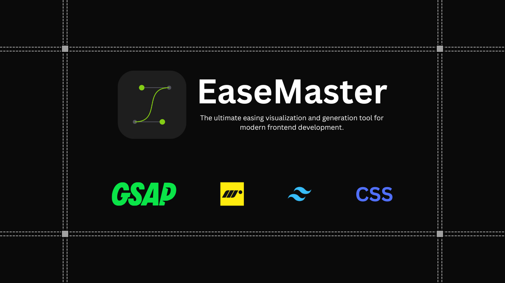

# EaseMaster



> **Design motion that feels real.**
> The ultimate easing visualization and generation tool for modern frontend development.

EaseMaster bridges the gap between design and engineering. It allows developers to visualize Cubic Bezier curves and Spring physics side-by-side and instantly generate production-ready code for **CSS**, **Tailwind**, **Framer Motion**, and **GSAP**.


## ✨ Features

- **Dual Modes:**
  - 📐 **Cubic Bezier Editor:** Drag handles to create custom curves with real-time visualization.
  - 🌀 **Spring Physics Engine:** Adjust Mass, Stiffness, and Damping to create organic motion.
- **Multi-Framework Export:**
  - Generate standard **CSS** `transition` strings.
  - Generate **Tailwind CSS** arbitrary values (e.g., `ease-[...]`).
  - Generate **Framer Motion** transition objects.
  - Generate **GSAP** tweens (including `CustomEase` support).
- **Advanced Preview:**
  - Real-time playground to test Position, Scale, Opacity, and Rotation.
  - Visual comparison of how the ease affects different properties.
- **Smart Presets:**
  - Includes industry standards (Penner Equations, Material Design).
  - Includes OS-style springs (iOS Fluid, Android Pop).
- **Linear Approximation:**
  - Automatically converts complex Spring physics into CSS `linear()` functions for use in pure CSS/Tailwind without JavaScript libraries.
- **Theming:**
  - Built with **Shadcn UI** compatibility.
  - Fully responsive with Dark/Light mode support.

## 🛠️ Tech Stack

- **Framework:** [Next.js](https://nextjs.org/) (App Router)
- **Language:** [TypeScript](https://www.typescriptlang.org/)
- **Styling:** [Tailwind CSS](https://tailwindcss.com/)
- **UI Components:** [Shadcn UI](https://ui.shadcn.com/)
- **State Management:** [Zustand](https://github.com/pmndrs/zustand)
- **Icons:** [Lucide React](https://lucide.dev/)
- **Math:** Custom physics solvers for Spring-to-Linear conversion.

## 🚀 Getting Started

Follow these steps to run EaseMaster locally.

### Prerequisites

- Node.js 18+
- pnpm or yarn

### Installation

1. **Clone the repository**

   ```bash
   git clone https://github.com/satishkumarsajjan/ease-master.git
   cd ease-master
   ```

2. **Install dependencies**

   ```bash
   pnpm install
   # or
   yarn install
   ```

3. **Run the development server**

   ```bash
   pnpm run dev
   ```

4. **Open your browser**
   Navigate to `http://localhost:3000` to see the application.

## 📖 How It Works

### The Spring Problem

CSS transitions natively support Cubic Beziers, but Beziers cannot represent the "bounce" of a spring physics simulation.

**EaseMaster solves this** by running a physics simulation in the background (`RK4` integration). For CSS/Tailwind exports, it samples the physics curve and generates a `linear(0, 0.1, 1.2, ...)` function that approximates the spring motion with high precision, allowing you to use bouncy springs in pure CSS.

## 🤝 Contributing

Contributions are welcome! Please follow these steps:

1. Fork the project.
2. Create your feature branch (`git checkout -b feature/AmazingFeature`).
3. Commit your changes (`git commit -m 'Add some AmazingFeature'`).
4. Push to the branch (`git push origin feature/AmazingFeature`).
5. Open a Pull Request.

## 📄 License

Distributed under the MIT License.

## 👨‍💻 Author

**SATISH KUMAR**

- [Website](https://satishkumar.xyz/)
- [X](https://x.com/iamsatish4564)

---

_Built with ❤️ for the frontend community._
